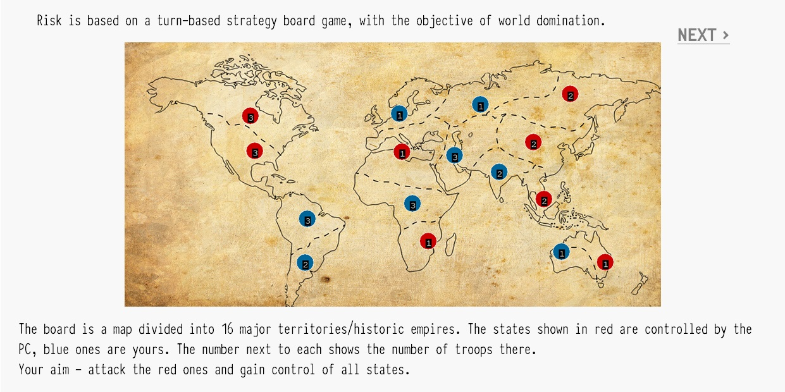
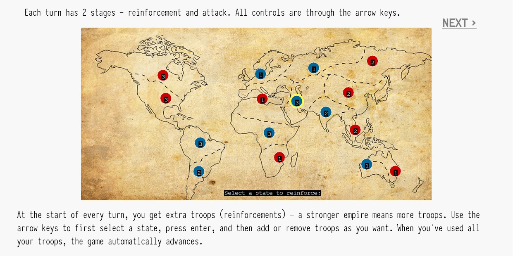
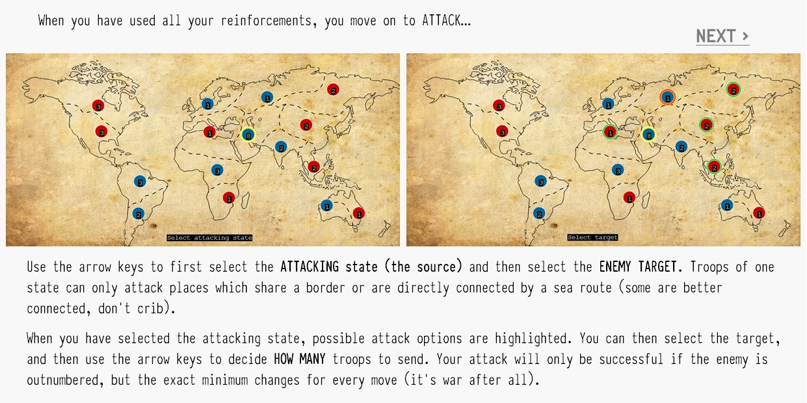
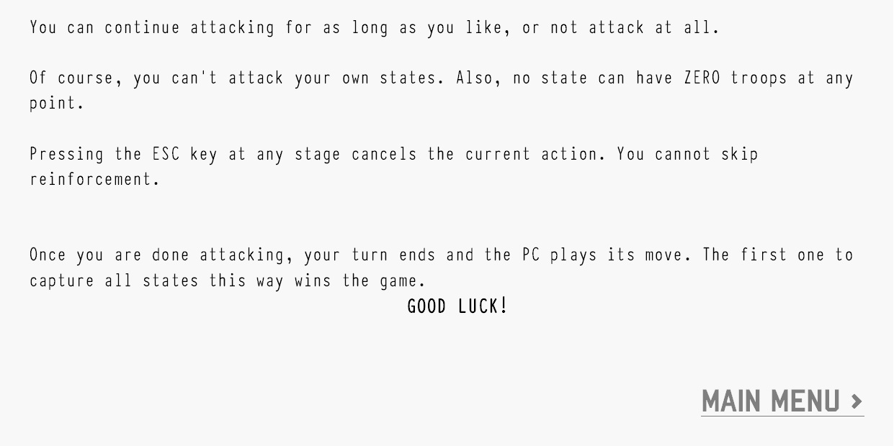

# Adversarial agent for Risk board-game
A basic game-playing agent I built as a high-school project. It plays the strategy board game, [Risk](https://en.wikipedia.org/wiki/Risk_(game)), against a human player and is able to match the skill of advanced human player.

Note that this is a fairly old project and not actively maintained. It uses the `graphics.h` library for graphics support and is for Windows only.
### Screenshots
---------------

